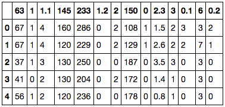
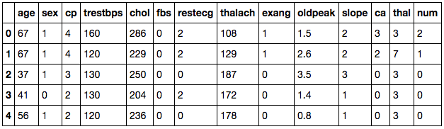

# Predict Presence Of Heart Disease 

## Problem
Heart diseases is a term covering any disorder of the heart. Heart diseases have become a major concern to deal with as studies show that the number of deaths due to heart diseases have increased significantly over the past few decades in India, in fact, it has become the leading cause of death in India.


Can we predict the presence of one of four types of heart disease(or none at all) using a patient's medical test report data.


## Solution Guideline

A study shows that from 1990 to 2016 the death rate due to heart diseases have increased around 34 percent from 155.7 to 209.1 deaths per one lakh population in India. Thus preventing Heart diseases has become more than necessary. Good data-driven systems for predicting heart diseases can improve the entire research and prevention process, making sure that more people can live healthy lives. This is where Machine Learning comes into play. Machine Learning helps in predicting Heart diseases, and the predictions made are quite accurate.

Machine Learning is used across many spheres around the world. The healthcare industry is no exception. Machine Learning can play an essential role in predicting presence/absence of Locomotor disorders, Heart diseases and more. Such information, if predicted well in advance, can provide important insights to doctors who can then adapt their diagnosis and treatment per patient basis.


## Data Sources
We have Heart disease data set consists of patient data from Cleveland, Hungary, Long Beach, and Switzerland. The combined dataset consists of 14 features and 916 samples with many missing values.

**Dataset:** `https://archive.ics.uci.edu/ml/datasets/heart+Disease`

## Data Exploration
In data science the `70%` to `80%` of tasks are mainly taken for `data preprocessing`. Lets deep dive into the data and process the raw dataset into effective pandas dataframes.
Based on the given dataset lets explore each column and value metrics of each column.

- `age`: The patients age in years
- `sex`: The patients gender(`1 = male` and `0 = female`)
- `cp`: Chest pain type, `Value 1`: typical angina `Value 2`: atypical angina `Value 3`: non-anginal pain `Value 4`: asymptomatic
- `trestbps`: Resting blood pressure (in `mm Hg` on admission to the hospital)
- `chol`: Serum cholestoral in `mg/dl`
- `fbs`: Fasting blood sugar > `120 mg/dl`(`1 = true`; `0 = false`)
- `restecg`: Resting electrocardiographic results `Value 0`: normal `Value 1`: having ST-T wave abnormality (T wave inversions and/or ST elevation or depression of > 0.05 mV) `Value 2`: showing probable or definite left ventricular hypertrophy by Estes' criteria
- `thalach`: Maximum heart rate achieved
- `exang`: Chest pain(angina) after exercise? (`1 = yes` and `0 = no`)
- `thal`: Not described `Value 3`: normal `Value 6`: treated defect `Value 7`: reversible defect
- `num`: Target `Value 0`: less than 50% narrowing of coronary arteries(no heart disease) `Value 1,2,3,4`: `>50% narrowing`. The value indicates the stage of heart disease


#### Import libraries

```python
# Let import the python data wrangling packages
import os
import pandas as pd
import numpy as np
```

#### Convert all datasets into `pandas dataframes`

```python
'''
Create a folder inside root folder called `dataset` 
and save those `csv` files into dataset directory
'''

# Lets convert all csv into pandas dataframes
df1 = pd.read_csv('dataset/processed_cleveland.csv')
df2 = pd.read_csv('dataset/processed_hungarian.csv')
df3 = pd.read_csv('dataset/processed_switzerland.csv')
df4 = pd.read_csv('dataset/processed_va.csv')
```

#### Fill Missing Values with NaN
Now the all the dataframe has been checked for missing values ?

```python
df1 = df1.replace('?', np.nan)
df2 = df2.replace('?', np.nan)
df3 = df3.replace('?', np.nan)
df4 = df4.replace('?', np.nan)
```

We can see one example there are no column headers in any of the above dataframes

```python
df1.head()
```


We can see none of the dataframes have a column headers are present. We can refer the column headers from the UCI dataset repository and the information is obtained as below. Each column header is given with its index number. 

### Attribute Information:

Only 14 attributes used: 
1. age 
2. sex 
3. cp 
4. trestbps 
5. chol 
6. fbs 
7. restecg 
8. thalach 
9. exang 
10. oldpeak 
11. slope 
12. ca
13. thal 
14. (num) (the predicted attribute) 

```python
# Assign column headers to all four dataframes
col = ['age', 'sex', 'cp', 'trestbps', 'chol', 'fbs', 'restecg',
       'thalach', 'exang', 'oldpeak', 'slope', 'ca', 'thal', 'num']
df1.columns = col
df2.columns = col
df3.columns = col
df4.columns = col
```

Now lets check any one dataframe structure using

```python
df1.head()
```



```python
# Check for any missing values in all four dataframes using `isnull()` and `sum()`
print "Cleveland Size={}\nNumber of missing values".format(df1.shape)
print df1.isnull().sum()
print "Hungary Size={}\nNumber of missing values".format(df2.shape)
print df2.isnull().sum()
print "Switzerland Size={}\nNumber of missing values".format(df3.shape)
print df3.isnull().sum()
print "V.A Long Beach Size={}\nNumber of missing values".format(df4.shape)
print df4.isnull().sum()

```

Output:

```
Cleveland Size=(302, 14)
Number of missing values
age         0
sex         0
cp          0
trestbps    0
chol        0
fbs         0
restecg     0
thalach     0
exang       0
oldpeak     0
slope       0
ca          4
thal        2
num         0
dtype: int64
Hungary Size=(293, 14)
Number of missing values
age           0
sex           0
cp            0
trestbps      1
chol         23
fbs           8
restecg       1
thalach       1
exang         1
oldpeak       0
slope       189
ca          290
thal        265
num           0
dtype: int64
Switzerland Size=(122, 14)
Number of missing values
age           0
sex           0
cp            0
trestbps      2
chol          0
fbs          74
restecg       1
thalach       1
exang         1
oldpeak       6
slope        17
ca          117
thal         51
num           0
dtype: int64
V.A Long Beach Size=(199, 14)
Number of missing values
age           0
sex           0
cp            0
trestbps     56
chol          7
fbs           7
restecg       0
thalach      53
exang        53
oldpeak      56
slope       102
ca          197
thal        165
num           0
dtype: int64
```


## Merge All Four Dataframes

After confirming that no missing values are present in all the dataframes, we are good to merge all four dataset for building our machine learning model.

```python
# .concat method takes multiple dataframes and merges it.
df = pd.concat([df1, df2, df3, df4])
df = df.fillna(df.median())
```

## Data Modeling

Now we have preprocessed the data for building our prediction model. `Scikit-Learn` is an machine learning library built using python and it very well works with pandas dataframes. Lets start diving deep into building a model. As its a classification problem we can try testing `supervised classification algorithms` such as `DecisionTree, RandomForest, LinearSVC`. 

Lets pick RandomForest for this problem statement. Random Forest is a flexible, easy to use machine learning algorithm that produces, even without hyper-parameter tuning, a great result most of the time. It is also one of the most used algorithms, because it's simplicity and the fact that it can be used for both classification and regression tasks.

```python
# Import the machine learning models and utility functions
from sklearn.preprocessing import MinMaxScaler
from sklearn.ensemble import RandomForestClassifier
from sklearn.externals import joblib
import pickle
from sklearn.metrics import accuracy_score
from sklearn.model_selection import train_test_split
```

## Building Training/Test Samples

Lets split the given dataframe **`df`** into **`training data - 70%`** and **`test data - 30%`** which will help us to cross-validate the prediction score.

```python
# Split the dataframe into 70/30 by setting the parameter `test_size=0.30`
train, test = train_test_split(df, test_size=0.30)

'''
    Lets remove the target variable(variable to be predicted) from training data and assing into
    seperate variable called Y_train
'''
X_train = train.drop('num', axis=1)
Y_train = train['num']

'''
    Lets remove the target variable(variable to be predicted) from test data and assing into
    seperate variable called Y_test
'''
X_test = test.drop('num', axis=1)
Y_test = test['num']
```

## Scale the dataset 
The `MinMaxScaler` is probably the most famous scaling algorithm and it follows the following formula for each feature:
Basically, it shrinks the range such that it is now between 0 and 1 (or -1 to 1 if there exist negative values).
The `MinMaxScaler` works well for cases when the distribution is not Gaussian or when the standard deviation is very small. However, it is sensitive to outliers — though this be rectified by `RobustScaler`, which we will see soon.

```python
# We don't scale targets: Y_test, Y_train as SVC returns the class labels not probability values
scaler = MinMaxScaler()
X_train = scaler.fit_transform(X_train)
X_test = scaler.fit_transform(X_test)
```

## Train Model

We have reached most interesting part of this use-case. Lets instantiate RF (RandomForest) estimator from `scikit-learn` class and train the model created. RF estimator comes with `.fit` method which can take two input's as parameter `X_train` and `Y_train`.

- `X_train`: 70% training data excluding `num` column.
- `Y_train`: `num` column from 70% training data which was dropped.

```python
# Instantiate RandomForest Classifier
clf = RandomForestClassifier()

# Training the classifier
clf.fit(X_train, Y_train)
```


## Model Evaluation

Lets use `.predict()` method in estimator to pass the test data and get prediction. We can evaluate RandomForest estimator using `accuracy_score()` method.

```python
acc = 0
acc_binary = 0
for i in range(0, 20):
    Y_hat = clf.predict(X_test)
    Y_hat_bin = Y_hat>0
    Y_test_bin = Y_test>0
    acc = acc + accuracy_score(Y_hat, Y_test)
    acc_binary = acc_binary +accuracy_score(Y_hat_bin, Y_test_bin)

print "Average test Accuracy:{}".format(acc/20)
print "Average binary accuracy:{}".format(acc_binary/20)
```

Output:
```
Average test Accuracy:0.578181818182
Average binary accuracy:0.807272727273
```

## Save Trained Model 

Now we have built a Random forest classifier achieves an average multi-class classification accuracy of 56-60%(183 test samples). It gets 75-80% average binary classification accuracy(heart disease or no heart disease). 

We can now use it for production via `web app`, `api` or `sdk`. In order to productionize this model we need to save the trained model, so that we dont need to train it every time for each prediction.

As a data scientist, you will use sets of data in the form of dictionaries, DataFrames, or any other data type. When working with those, you might want to save them to a file, so you can use them later on or send them to someone else. This is what Python's pickle module is for: it serializes objects so they can be saved to a file, and loaded in a program again later on.

Lets create a directory inside root folder called `models` before executing below code.

```python
# Saving the trained model for inference
model_path ='models/rfc.sav'
joblib.dump(clf, model_path)


# Saving the scaler object also for future references
scaler_path = 'models/scaler.pkl'
with open(scaler_path, 'wb') as scaler_file:
    pickle.dump(scaler, scaler_file)

```

## Outcome
We have built a Random forest classifier achieves an average multi-class classification accuracy of 56-60%(183 test samples). It gets 75-80% average binary classification accuracy(heart disease or no heart disease). We can improve the accuracy and performance for this model using `Feature Engineering` and `Hyperparameter Tunning` which we will see in upcoming use-cases.

### Links:
- UCI dataset: https://archive.ics.uci.edu/ml/datasets/heart+Disease
- Random Forest: https://scikit-learn.org/stable/modules/generated/sklearn.ensemble.RandomForestClassifier.html
  
